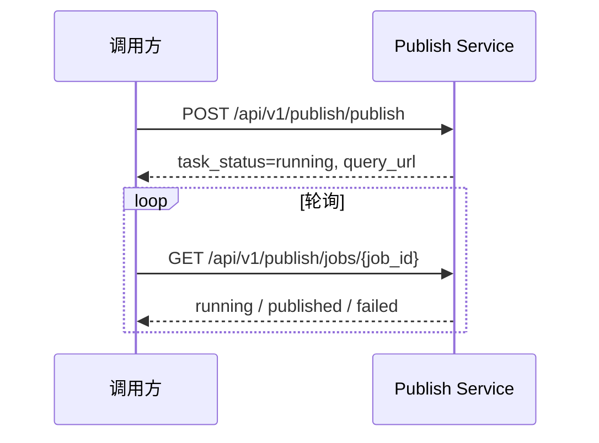
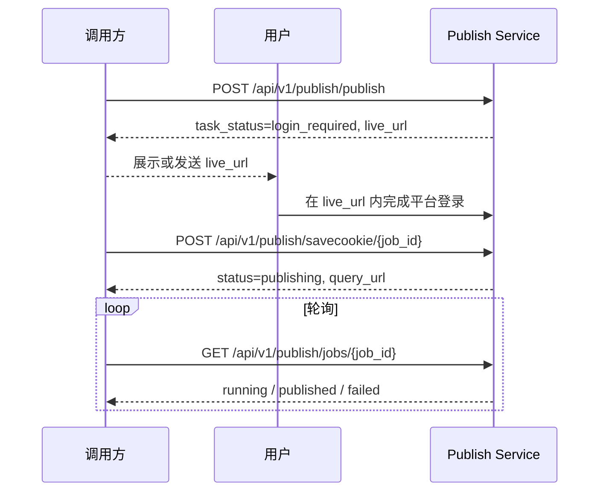
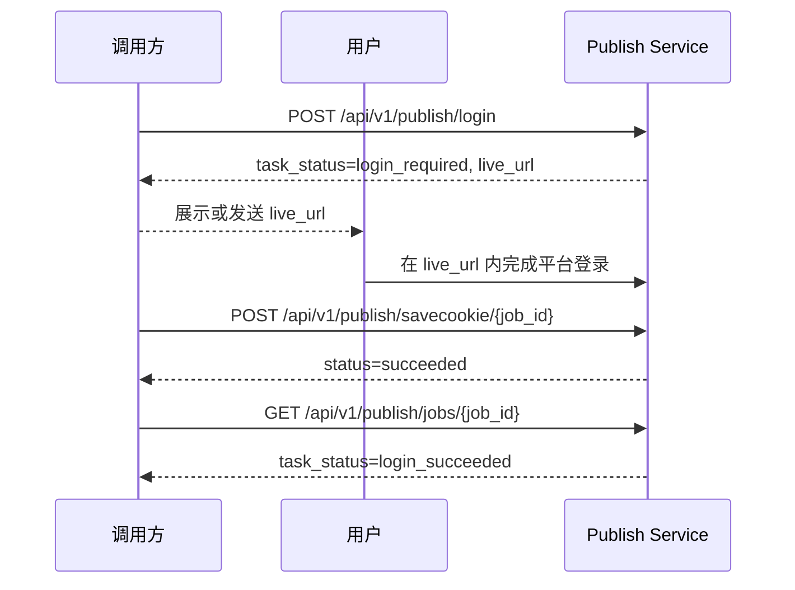

# Browser Publish Service 接口文档

本文档面向业务调用方，说明自动发文服务的 HTTP 接口、鉴权方式、任务状态流转和远程登录使用方式。

## 1. 服务地址

服务内部监听端口为 `19000`。

| 场景 | Base URL |
|---|---|
| 本地 Python/Conda 启动 | `http://127.0.0.1:19000` |
| Docker Compose 默认映射 | `http://127.0.0.1:8000` |
| 容器或服务内访问 | `http://<service-host>:19000` |

下文以 `http://127.0.0.1:8000` 为示例。若你是本地直接运行 Python，请把示例里的端口替换为 `19000`。

## 2. 鉴权

除健康检查外，所有业务接口都需要 Bearer Token。

请求头：

```http
Authorization: Bearer <PUBLISH_API_TOKEN>
Content-Type: application/json
```

`PUBLISH_API_TOKEN` 来自服务端环境变量。未传、传错或服务端未配置 token 时，业务接口返回：

```json
{
  "code": 401,
  "message": "unauthorized",
  "data": {}
}
```

注意：业务错误码主要放在 JSON 响应体的 `code` 字段中；HTTP 状态通常仍为 `200`。请求体字段类型或必填校验失败时，FastAPI 会返回 HTTP `422`。

## 3. 通用模型

### 3.1 任务创建响应

`POST /api/v1/publish/publish` 和 `POST /api/v1/publish/login` 返回统一结构：

```json
{
  "code": 200,
  "message": "任务创建成功",
  "data": {
    "job_id": "任务 ID",
    "task_status": "running | login_required | failed",
    "query_url": "/api/v1/publish/jobs/{job_id}",
    "remote_session_id": "远程登录 session ID，非登录流程为空",
    "live_url": "远程登录或发布实时查看地址，可能为空",
    "log_file_path": "任务日志路径",
    "reason": "失败原因，仅失败时可能出现"
  }
}
```

调用方只应使用 `live_url` 打开远程画面。旧字段 `login_url` 不再作为业务接口字段暴露。

### 3.2 Cookie 模型

服务按用户和平台隔离 Cookie：

```text
data/cookies/{platform}/{user_id}.json
```

当前 Cookie 文件采用 Playwright storage state 结构：

```json
{
  "cookies": [
    {
      "name": "sessionid",
      "value": "...",
      "domain": ".toutiao.com",
      "path": "/"
    }
  ],
  "origins": []
}
```

发文前服务会根据 `platform` 和 `user_id` 查找该文件。Cookie 不存在或无效时，服务返回远程登录地址，由用户登录后再保存 Cookie。

## 4. 接口列表

### 4.1 健康检查

```http
GET /api/v1/publish/health
```

是否需要鉴权：否。

请求示例：

```powershell
curl.exe http://127.0.0.1:8000/api/v1/publish/health
```

响应示例：

```json
{
  "status": "ok",
  "service": "publish"
}
```

### 4.2 创建发文任务

```http
POST /api/v1/publish/publish
```

创建一条自动发文任务。接口会立即返回任务信息，不会阻塞等待文章发布完成。

请求字段：

| 字段 | 类型 | 必填 | 默认值 | 说明 |
|---|---|---:|---|---|
| `user_id` | string | 是 | 无 | 业务侧用户标识，用于隔离 Cookie |
| `platform` | string | 否 | `toutiao` | 发布平台；当前发文主流程为 `toutiao` |
| `title` | string | 是 | 无 | 文章标题，最长 200 字符 |
| `content` | string | 是 | 无 | 文章正文 |
| `cover_image_url` | string/null | 否 | `null` | 封面图片 URL |

请求示例：

```powershell
curl.exe -X POST http://127.0.0.1:8000/api/v1/publish/publish `
  -H "Authorization: Bearer <PUBLISH_API_TOKEN>" `
  -H "Content-Type: application/json" `
  -d "{\"user_id\":\"user_001\",\"platform\":\"toutiao\",\"title\":\"测试标题\",\"content\":\"文章正文内容\",\"cover_image_url\":\"https://example.com/cover.jpg\"}"
```

#### 4.2.1 已有有效 Cookie

如果该用户已有有效 Cookie，服务会进入后台发文流程。

响应示例：

```json
{
  "code": 200,
  "message": "任务创建成功，发布任务正在后台执行",
  "data": {
    "job_id": "9c833a78-4f42-4c98-aef6-cc7d0d06a7f8",
    "task_status": "running",
    "query_url": "/api/v1/publish/jobs/9c833a78-4f42-4c98-aef6-cc7d0d06a7f8",
    "remote_session_id": "",
    "live_url": "",
    "log_file_path": "logs/jobs/9c833a78-4f42-4c98-aef6-cc7d0d06a7f8.log"
  }
}
```

后续调用 `query_url` 查询最终发布结果。

#### 4.2.2 需要远程登录

如果 Cookie 不存在或无效，服务会启动远程浏览器登录流程。

响应示例：

```json
{
  "code": 200,
  "message": "任务创建成功，需要用户登录",
  "data": {
    "job_id": "9c833a78-4f42-4c98-aef6-cc7d0d06a7f8",
    "task_status": "login_required",
    "query_url": "/api/v1/publish/jobs/9c833a78-4f42-4c98-aef6-cc7d0d06a7f8",
    "remote_session_id": "8c3d7d99-a5e4-4b3a-bd0a-2c2cb43315f1",
    "live_url": "https://example.trycloudflare.com/vnc/8c3d7d99-a5e4-4b3a-bd0a-2c2cb43315f1/?token=8c3d7d99-a5e4-4b3a-bd0a-2c2cb43315f1&path=vnc%2F8c3d7d99-a5e4-4b3a-bd0a-2c2cb43315f1%2Fwebsockify",
    "log_file_path": "logs/jobs/9c833a78-4f42-4c98-aef6-cc7d0d06a7f8.log"
  }
}
```

调用方应把 `live_url` 展示给用户。用户在远程浏览器内完成登录后，调用 `POST /api/v1/publish/savecookie/{job_id}` 保存 Cookie 并继续原发文任务。

### 4.3 创建仅登录任务

```http
POST /api/v1/publish/login
```

只启动远程登录并保存 Cookie，不执行发文。适用于提前为某个用户准备或刷新 Cookie。

请求字段：

| 字段 | 类型 | 必填 | 默认值 | 说明 |
|---|---|---:|---|---|
| `user_id` | string | 是 | 无 | 业务侧用户标识 |
| `platform` | string | 否 | `toutiao` | 登录平台 |

请求示例：

```powershell
curl.exe -X POST http://127.0.0.1:8000/api/v1/publish/login `
  -H "Authorization: Bearer <PUBLISH_API_TOKEN>" `
  -H "Content-Type: application/json" `
  -d "{\"user_id\":\"user_001\",\"platform\":\"toutiao\"}"
```

响应示例：

```json
{
  "code": 200,
  "message": "登录任务创建成功，需要用户登录",
  "data": {
    "job_id": "64d9df1e-dcc1-4d7e-8c44-7f3e5932ac72",
    "task_status": "login_required",
    "query_url": "/api/v1/publish/jobs/64d9df1e-dcc1-4d7e-8c44-7f3e5932ac72",
    "remote_session_id": "c2d51115-2bb0-4828-8a4e-dc48b63b5d37",
    "live_url": "https://example.trycloudflare.com/vnc/c2d51115-2bb0-4828-8a4e-dc48b63b5d37/?token=c2d51115-2bb0-4828-8a4e-dc48b63b5d37&path=vnc%2Fc2d51115-2bb0-4828-8a4e-dc48b63b5d37%2Fwebsockify",
    "log_file_path": "logs/jobs/64d9df1e-dcc1-4d7e-8c44-7f3e5932ac72.log"
  }
}
```

用户登录完成后，同样调用 `POST /api/v1/publish/savecookie/{job_id}`。仅登录任务保存 Cookie 后状态会变为 `login_succeeded`，不会触发发文。

### 4.4 查询任务状态

```http
GET /api/v1/publish/jobs/{job_id}
```

查询任务当前状态、远程登录地址、发布实时查看地址或最终发布结果。

是否需要鉴权：是。

请求示例：

```powershell
curl.exe http://127.0.0.1:8000/api/v1/publish/jobs/9c833a78-4f42-4c98-aef6-cc7d0d06a7f8 `
  -H "Authorization: Bearer <PUBLISH_API_TOKEN>"
```

状态表：

| `code` | `task_status` | 说明 | `data` 常见字段 |
|---:|---|---|---|
| `202` | `running` | 任务排队、检查 Cookie、启动远程登录或发布中 | `job_id`, `live_url` |
| `401` | `login_required` | 需要用户打开 `live_url` 完成远程登录 | `job_id`, `live_url` |
| `200` | `login_succeeded` | 仅登录任务已保存 Cookie | `job_id`, `user_id`, `platform`, `cookie_ready`, `live_url` |
| `200` | `published` | 文章发布完成 | `job_id`, `user_id`, `platform`, `title`, `cover_image_url`, `article_url`, `publish_result`, `live_url` |
| `408` | `expired` | 浏览器 session 已过期 | `job_id`, `live_url` |
| `410` | `closed` | 浏览器 session 已关闭 | `job_id` |
| `404` | `not_found` | 任务不存在 | `job_id` |
| `503` | `query_failed` | 查询任务状态失败 | `job_id` |
| `500` | `failed` | 任务失败 | `job_id`, `reason`, `live_url` |

发布中响应示例：

```json
{
  "code": 202,
  "task_status": "running",
  "message": "发布任务正在后台执行",
  "data": {
    "job_id": "9c833a78-4f42-4c98-aef6-cc7d0d06a7f8",
    "live_url": "https://example.trycloudflare.com/..."
  }
}
```

需要登录响应示例：

```json
{
  "code": 401,
  "task_status": "login_required",
  "message": "需要用户登录或 Cookie 已失效",
  "data": {
    "job_id": "9c833a78-4f42-4c98-aef6-cc7d0d06a7f8",
    "live_url": "https://example.trycloudflare.com/vnc/..."
  }
}
```

仅登录成功响应示例：

```json
{
  "code": 200,
  "task_status": "login_succeeded",
  "message": "登录 Cookie 保存成功",
  "data": {
    "job_id": "64d9df1e-dcc1-4d7e-8c44-7f3e5932ac72",
    "user_id": "user_001",
    "platform": "toutiao",
    "cookie_ready": true,
    "live_url": ""
  }
}
```

发布成功响应示例：

```json
{
  "code": 200,
  "task_status": "published",
  "message": "文章发布成功",
  "data": {
    "job_id": "9c833a78-4f42-4c98-aef6-cc7d0d06a7f8",
    "user_id": "user_001",
    "platform": "toutiao",
    "title": "测试标题",
    "cover_image_url": "https://example.com/cover.jpg",
    "article_url": "https://www.toutiao.com/item/...",
    "publish_result": {
      "success": true,
      "account_name": "账号名称",
      "platform_user_id": "平台用户 ID",
      "article_title": "测试标题",
      "publish_signal": "",
      "operation_time": "2026-06-09 10:00:00"
    },
    "live_url": ""
  }
}
```

失败响应示例：

```json
{
  "code": 500,
  "task_status": "failed",
  "message": "发布失败",
  "data": {
    "job_id": "9c833a78-4f42-4c98-aef6-cc7d0d06a7f8",
    "reason": "失败原因",
    "live_url": ""
  }
}
```

### 4.5 保存远程登录 Cookie

```http
POST /api/v1/publish/savecookie/{job_id}
```

用户打开 `live_url` 并完成平台登录后，调用该接口从远程浏览器 session 中提取 Cookie，保存到 `data/cookies/{platform}/{user_id}.json`。

是否需要鉴权：是。

请求体：无。

请求示例：

```powershell
curl.exe -X POST http://127.0.0.1:8000/api/v1/publish/savecookie/9c833a78-4f42-4c98-aef6-cc7d0d06a7f8 `
  -H "Authorization: Bearer <PUBLISH_API_TOKEN>"
```

发文任务保存 Cookie 成功后，原任务会继续进入后台发布流程。

响应示例：

```json
{
  "code": 200,
  "job_id": "9c833a78-4f42-4c98-aef6-cc7d0d06a7f8",
  "status": "publishing",
  "message": "Cookie 保存成功，发文任务已继续后台执行",
  "live_url": "",
  "log_file_path": "logs/jobs/9c833a78-4f42-4c98-aef6-cc7d0d06a7f8.log",
  "result": {
    "cookie_count": 8,
    "query_url": "/api/v1/publish/jobs/9c833a78-4f42-4c98-aef6-cc7d0d06a7f8"
  }
}
```

仅登录任务保存 Cookie 成功后，不会继续发布。

响应示例：

```json
{
  "code": 200,
  "job_id": "64d9df1e-dcc1-4d7e-8c44-7f3e5932ac72",
  "status": "succeeded",
  "message": "登录 Cookie 保存成功",
  "live_url": "",
  "log_file_path": "logs/jobs/64d9df1e-dcc1-4d7e-8c44-7f3e5932ac72.log",
  "result": {
    "success": true,
    "login_only": true,
    "cookie_ready": true,
    "cookie_count": 8
  }
}
```

常见错误：

| `code` | `status` | `message` | 说明 |
|---:|---|---|---|
| `404` | `failed` | `job not found` | `job_id` 不存在 |
| `404` | `failed` | `remote login session not found` | 远程登录 session 不存在 |
| `409` | 当前任务状态 | `cookie already saved` | Cookie 已保存，任务已进入发布或已完成 |
| `409` | 当前任务状态 | `job has no remote login session` | 该任务没有远程登录 session |
| `409` | 当前任务状态 | `remote login runner not available` | 当前进程没有可用的远程登录 runner |
| `500` | `failed` | 异常信息 | Cookie 提取、校验或保存异常 |

## 5. 推荐调用流程

### 5.1 自动发文，Cookie 已存在



### 5.2 自动发文，首次需要用户登录



### 5.3 仅刷新用户 Cookie



## 6. 远程登录说明

远程登录使用 KasmVNC/Xvnc 展示浏览器画面，并通过 cloudflared 生成公网临时访问地址。

`live_url` 形态类似：

```text
https://<random>.trycloudflare.com/vnc/{session_id}/?token={token}&path=vnc%2F{session_id}%2Fwebsockify
```

调用方注意事项：

| 项目 | 说明 |
|---|---|
| 打开方式 | 直接在浏览器中打开接口返回的 `live_url` |
| URL 构造 | 不要自行拼接 `/vnc/{session_id}`，以接口返回值为准 |
| 安全参数 | `token` 是远程画面访问凭据，不要泄露给无关人员 |
| Cookie 保存 | 用户完成登录后，需要调用 `savecookie` 接口 |
| 链接生命周期 | 服务重启、session 关闭或超时后，原 `live_url` 会失效，需要重新创建任务 |

`/vnc/{session_id}/...` 是服务内部的远程画面代理路径，不作为业务接口直接调用。

## 7. 轮询建议

创建任务后，调用方应保存 `job_id` 并轮询 `query_url`。

建议策略：

| 阶段 | 建议间隔 | 退出条件 |
|---|---:|---|
| `running` | 2-5 秒 | 进入 `published`、`failed`、`login_required` 等终态或等待态 |
| `login_required` | 不需要高频轮询 | 用户登录后调用 `savecookie` |
| `publishing` | 2-5 秒 | 进入 `published` 或 `failed` |

调用方应把这些状态视为终态：`published`、`login_succeeded`、`failed`、`expired`、`closed`、`not_found`。

## 8. PowerShell 调用示例

设置变量：

```powershell
$BaseUrl = "http://127.0.0.1:8000"
$Token = "<PUBLISH_API_TOKEN>"
$Headers = @{
  Authorization = "Bearer $Token"
  "Content-Type" = "application/json"
}
```

创建发文任务：

```powershell
$Body = @{
  user_id = "user_001"
  platform = "toutiao"
  title = "测试标题"
  content = "文章正文内容"
  cover_image_url = $null
} | ConvertTo-Json -Depth 5

$CreateResp = Invoke-RestMethod `
  -Method Post `
  -Uri "$BaseUrl/api/v1/publish/publish" `
  -Headers $Headers `
  -Body $Body

$CreateResp
```

打开远程登录地址：

```powershell
if ($CreateResp.data.task_status -eq "login_required") {
  Start-Process $CreateResp.data.live_url
}
```

保存 Cookie：

```powershell
$JobId = $CreateResp.data.job_id
Invoke-RestMethod `
  -Method Post `
  -Uri "$BaseUrl/api/v1/publish/savecookie/$JobId" `
  -Headers @{ Authorization = "Bearer $Token" }
```

查询任务：

```powershell
Invoke-RestMethod `
  -Method Get `
  -Uri "$BaseUrl/api/v1/publish/jobs/$JobId" `
  -Headers @{ Authorization = "Bearer $Token" }
```

## 9. OpenAPI/Swagger

服务启动后，可访问 FastAPI 自动生成的接口页面：

```text
http://127.0.0.1:8000/docs
http://127.0.0.1:8000/openapi.json
```

如果是本地 Python/Conda 直接启动，请使用：

```text
http://127.0.0.1:19000/docs
http://127.0.0.1:19000/openapi.json
```

Swagger 页面会显示 Bearer Token 鉴权方案；健康检查接口不需要鉴权。
